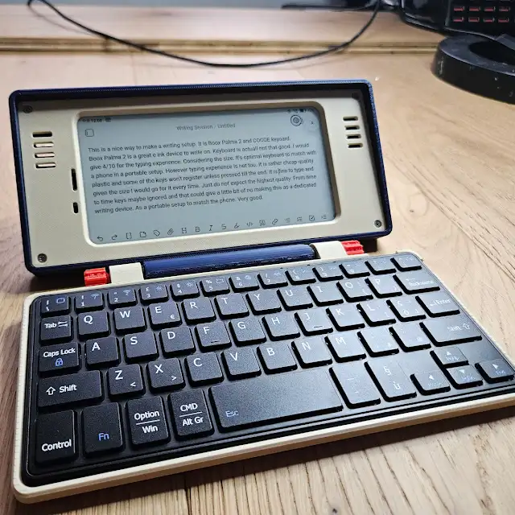
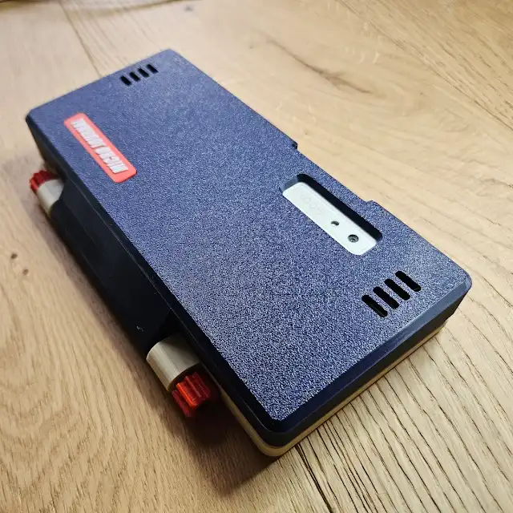
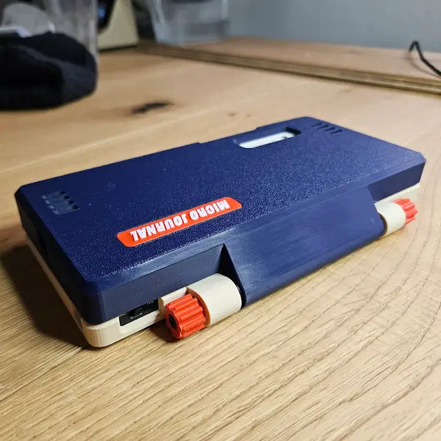
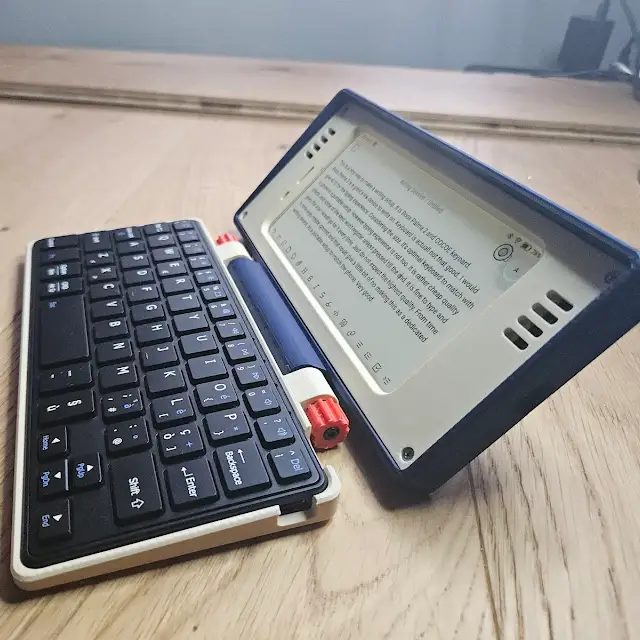

# The PDA Terminal by Un Kyu Lee

This is a small handheld PDA style writing setup built around the Boox Palma 2 and a compact Bluetooth keyboard. The form is inspired by classic PDAs, where screen and keyboard come together as a single object, designed for focus rather than distraction.

It is not meant to replace a laptop or a phone. It is meant to create a small, personal space for writing.

## Why this exists?

I use this setup primarily as a writing device.
It comes with me when I want to think, draft ideas, write emails carefully, or simply put words down without noise.

There are many possible uses for a setup. Such as a portable email client, a lightweight organizer, a travel journal, or a quiet companion on long journeys. But at its core, this project is about reclaiming attention and turning writing into a deliberate act again.

This is also an exploration of reuse. Old or secondary phones often end up unused, forgotten in drawers. This project imagines another life for them, transforming familiar devices into something slower, calmer, and more purposeful.

## A Project at The Beginning

Right now, the project is in an early draft stage. The current design supports the Boox Palma 2, but the intention is to explore how this concept can adapt to other devices over time.

In 2026, I plan to dive deeper into this idea. That includes experimenting with more phone models, refining the physical design, and documenting what it is actually like to live with a keyboard-first mobile setup.

More than just hardware, I want this project to carry stories. How does it change the way I write? When does it feel useful, and when does it get in the way? Is there real value in this slower approach?

Like my other project, "[micro journal](https://github.com/unkyulee/micro-journal)", this may become an iterative process that unfolds over years. Small improvements, small discoveries, and occasional redesigns. The goal is not speed, but clarity.

My hope is that this repository becomes a record of that journey.

## Build Your Own

This repository includes 3D printable files that allow you to build the setup yourself.

* [STL Files](./STL/)

The design has a small footprint and should be printable on most compact 3D printers.

You will need:

* Boox Palma 2
* CACOE Keyboard

To Assemble:

* 4x M2 screw 5 ~ 10 mm 
* 4x M2 Heated Inserts OD 3.2mm Length 3mm
* 2x M3 screw 40 mm
* 2x rubber O-ring 10x5.2x2.4

Assembly is straightforward and intended to be approachable, even if this is your first small DIY project. No soldering required.

## Photo

## Community

* [Focused Writing Device Forum](https://www.flickr.com/groups/alphasmart/discuss/)

## Contact

* [YouTube – @unkyulee](https://www.youtube.com/@unkyulee)
* [Reddit – Background\_Ad\_1810](https://www.reddit.com/user/Background_Ad_1810/)
* [Un Kyu Lee's Design Gallery](https://www.yesbut.it/)

## License

Creative Commons Attribution NonCommercial 4.0 International
CC BY NC 4.0

You are free to:

Share: copy and redistribute the material in any medium or format
Adapt: remix, transform, and build upon the material

Under the following terms:

Attribution: You must give appropriate credit, provide a link to the license, and indicate if changes were made.
NonCommercial: You may not use the material for commercial purposes.
No additional restrictions: You may not apply legal terms or technological measures that legally restrict others from doing anything the license permits.

No warranties are given. Other rights such as privacy, publicity, or moral rights may still apply.